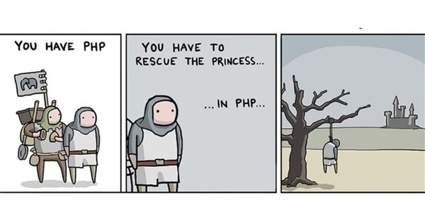
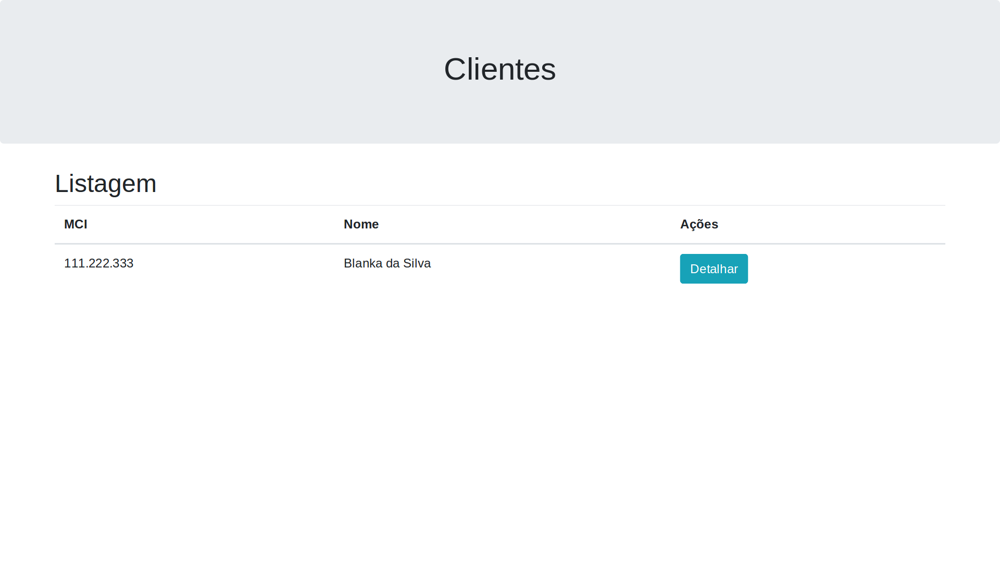
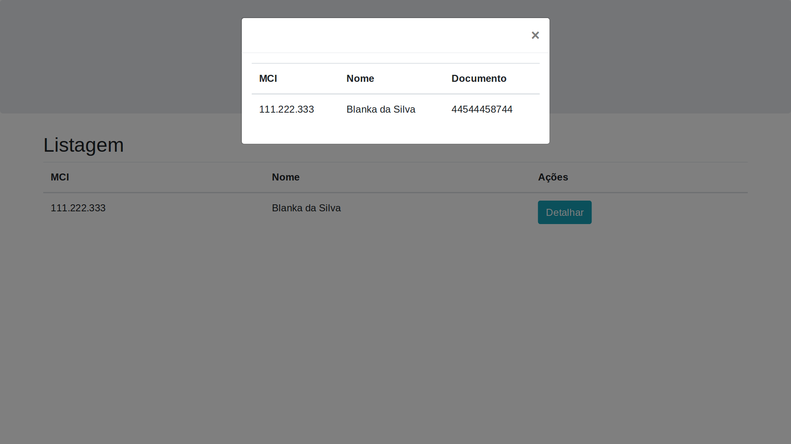
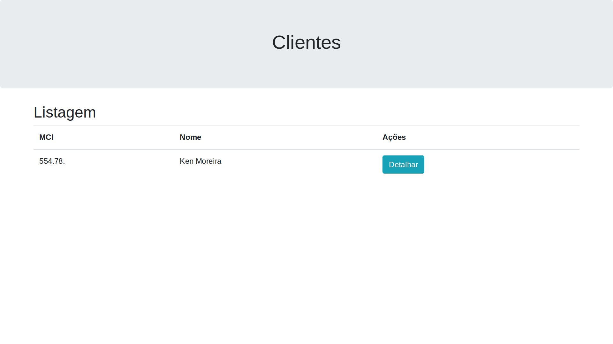
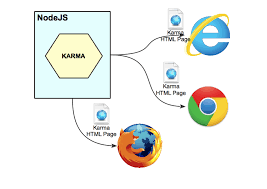
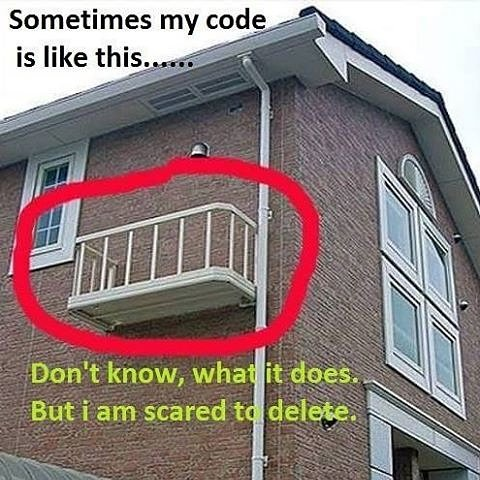

<!--
* meme testes de integracao
* let it go
* http://blog.caelum.com.br/testes-sao-mais-do-que-regressao-os-beneficios-no-design/
* OWSAP - 2017
* quarto limpo
* quarto sujo
* ecossistema https://medium.com/@oieduardorabelo/o-ecossistema-de-testes-em-javascript-em-2017-74a78625aa15
-->

<!-- - URL para visualização: [https://gitpitch.com/tiagolpadua/5a-tecnica-testes-js/master](https://gitpitch.com/tiagolpadua/5a-tecnica-testes-js/master) -->

# 5a. Técnica - Testes em JS

- RAPHAEL HENRIQUE LACERDA PINHO (Arquiteto de Software)
- TIAGO LAGE PAYNE DE PÁDUA (Auxiliar **DE** Arquiteto de Software)


## EVENTO

* [Brasília Dev Festival](http://brasiliadevfestival.com.br/)

## Sobre o quê iremos falar
<!--
- Ecossistema de Testes
- BDD - Behavior Driven Development
- Conhecendo nossa aplicação
- Escrevendo um código testável
- Configurando o ambiente para testes
- Jasmine, um framework BDD
- Karma, automatizando o processo
- PhantomJS, testando em um navegador "sem cabeça"
- Istanbul, calculando a cobertura de nossos testes
-->
<blockquote class="twitter-tweet" data-lang="en"><p lang="en" dir="ltr">2 unit tests. 0 integration tests. <a href="https://t.co/iAqJMGokxc">pic.twitter.com/iAqJMGokxc</a></p>&mdash; The Practical Dev (@ThePracticalDev) <a href="https://twitter.com/ThePracticalDev/status/894564273053216769?ref_src=twsrc%5Etfw">August 7, 2017</a></blockquote>
<script async src="https://platform.twitter.com/widgets.js" charset="utf-8"></script>

<blockquote class="twitter-tweet" data-lang="en"><p lang="en" dir="ltr">2 unit tests<br>0 integration tests <a href="https://t.co/95RoYKy96b">pic.twitter.com/95RoYKy96b</a></p>&mdash; Dmitri Sotnikov ⚛ (@yogthos) <a href="https://twitter.com/yogthos/status/951905438727057408?ref_src=twsrc%5Etfw">January 12, 2018</a></blockquote>
<script async src="https://platform.twitter.com/widgets.js" charset="utf-8"></script>

## TDD/BDD/ATDD é tudo velho

* 1993

* 1996

* [2003](http://www.bugbang.com.br/entendendo-bdd-com-cucumber-parte-i/)

* [2006](https://dannorth.net/introducing-bdd/)

* [2009 - 10 anos de TDD](https://www.infoq.com/presentations/tdd-ten-years-later)

* [TDD.caelum.com.br](http://tdd.caelum.com.br/)


<!-- Dan North BDD-->

## Maurício Aniche

* [Profissão Testador](https://github.com/raphaelLacerda/apresentacao-tdd/blob/master/index.html)

    * 2010 - [Indústria com TDD](http://www.mauricioaniche.com/2010/04/tdd-realmente-ajuda/)

* 2017 - [Lint x Unit Test](http://www.mauricioaniche.com/2017/09/why-and-how-javascript-developers-use-linters/)


> *You need to seek all possible cases for unit tests, but sometimes it’s very hard, and
of course in all projects, unit tests don’t cover all possible
cases. So this is why a linter is a second protection line*

## Por quê vc não testa?

> Uso JavaEE - não sei isolar classes do contexto

> Só faço CRUD

> Entendo os ganhos, mas não tenho a manha

> Irá atrasar a entrega do projeto

> Custo alto! Meu progamador fará mais código

## Nova desculpa

* Eu só uso **JAVASCRIPT**

## My workspace...


## Como minha mulher vê


## OWSAP


## Ecossistema JS

<blockquote class="twitter-tweet" data-lang="en"><p lang="pt" dir="ltr">&quot;JS tá tão zueira que agora os posts vem todos com o ano, tipo:<br>- O Ecossistema de Testes em JavaScript em 2017<br>- How to learn React, Angular or Vue in 2018<br>- An Overview of JavaScript Testing in 2018&quot;<br>-- <a href="https://twitter.com/tiagolpadua?ref_src=twsrc%5Etfw">@tiagolpadua</a></p>&mdash; Alexandre Aquiles (@alex_aquiles) <a href="https://twitter.com/alex_aquiles/status/973339341400543238?ref_src=twsrc%5Etfw">March 12, 2018</a></blockquote>
<script async src="https://platform.twitter.com/widgets.js" charset="utf-8"></script>


## amanhã já muda...

* ambiente, sintaxe, asserção, browser, mocks, coverage


[Martin Fowler Mocks aren't stubs](https://martinfowler.com/articles/mocksArentStubs.html)
<!--JEST:

JEST - testes de unidade
DALEKJS - testes de Sistema
CHAI - asserções
http://unexpected.js.org/ - asserções
AVA - execução paralela
SINON - mocks

---
-->


## Mas poderia ser pior



## Um pouco de BDD
BDD ou Behavior Driven Development, é um estilo de testes onde você descreve (describe) os requisitos e informa aos testes o quê (it) ele deveria fazer.
Então você espera (expect) que seu código dê uma certa resposta.

---

```js
// Descreve os requisitos
describe ('pato.js', function () {

    // O quê deve fazer
    it('Deve saber nadar', function () {

        // espera alguma coisa
        expect(
            pato.sabeNadar()
        ).toBeTruthy();
    });
})
```

## Conhecendo nossa aplicação

### Sistema de Listagem de Clientes
---

---

---
## Recebemos um report de erro :-(

---
- Apresentação para aqui, segue o live coding
---
## Vamos entender como está estruturado nosso projeto
---
## Configurando o ambiente para testes
---
- npm install --save-dev jasmine
- criar o arquivo appSpec.js
- ./node_modules/.bin/jasmine src/appSpec.js
- Colocar o código abaixo em appSpec.js:
```js
describe('Listagem de Clientes', function () {
    'use strict';
    it('Deve validar que true é true', function () {
        expect(true).toBeTruthy();
    });
});
```
---
- Trocar o true por false pra ver o teste quebrar
- Vamos deixar os testes mais fáceis, colocando o script no npm
- "test": "jasmine src/appSpec.js"
- npm test
---
- Ok, agora já podemos testar nossa aplicação!
- Parece que o defeito é na hora de colocar a máscara no MCI
- Vixe, nosso código é muito acoplado...
- Isolando a funcionalidade de máscara em uma função
```js
function aplicaMascaraMCI(mci) {
    return mci.toString().substring(0, 3) + '.' +
        mci.toString().substring(3, 6) + '.' +
        mci.toString().substring(6, 9);
}
//...
$('#tblDetalhaCliente tbody').append(
    '<tr><td>' +
    aplicaMascaraMCI(cliente.mci) +
    '</td><td>' + cliente.nome + '</1td><td>' + cliente.documento + '</td></tr>'
);
//...
$('#tblClientes tbody').append(
    '<tr><td>' +
    aplicaMascaraMCI(cliente.mci) +
    '</td>' +
    '<td>' + cliente.nome + '</td>' +
    '<td><div class="btn-group" role="group">' +
    '<button type="button" class="btn btn-info" onclick="app.detalharCliente(' + cliente.mci + ')">Detalhar</button>' +
    '</div></td></tr>'
);
```
---
- Agora precisamos escrever o teste de fato:
```js
describe('Listagem de Clientes', function () {
    'use strict';
    it('Deve aplicar a máscara em um MCI informado', function () {
        expect(aplicaMascaraMCI(111222333)).toBe('111.222.333');
    });
});
```
---
> mci-clientes-estatico@1.0.0 test /kdi-box/git/5a-tecnica-testes-js
> jasmine src/appSpec.js

Randomized with seed 82134
Started
F

Failures:
1) Listagem de Clientes Deve aplicar a máscara em um MCI informado
  Message:
    ReferenceError: aplicaMascaraMCI is not defined
  Stack:
        at <Jasmine>
        at UserContext.<anonymous> (/kdi-box/git/5a-tecnica-testes-js/src/appSpec.js:10:16)
        at <Jasmine>
        at runCallback (timers.js:672:20)
        at tryOnImmediate (timers.js:645:5)
        at processImmediate [as _immediateCallback] (timers.js:617:5)

1 spec, 1 failure
Finished in 0.009 seconds
Randomized with seed 82134 (jasmine --random=true --seed=82134)
npm ERR! Test failed.  See above for more details.
---

- Precisamos de uma ferramenta para "levantar" o ambiente de testes...
- npm install --save-dev karma
- E para facilitar nossa vida, o karma-cli
- npm install --global karma-cli
- karma init




---
➜  5a-tecnica-testes-js git:(master) ✗ karma init
Which testing framework do you want to use ?
Press tab to list possible options. Enter to move to the next question.
> jasmine

Do you want to use Require.js ?
This will add Require.js plugin.
Press tab to list possible options. Enter to move to the next question.
> no

Do you want to capture any browsers automatically ?
Press tab to list possible options. Enter empty string to move to the next question.
>
26 02 2018 08:55:14.878:WARN [init]: Failed to install "karma-jasmine". No permissions to write in /usr/local/lib!
  Please install it manually.

What is the location of your source and test files ?
You can use glob patterns, eg. "js/*.js" or "test/**/*Spec.js".
Enter empty string to move to the next question.
> src/*.js
>

Should any of the files included by the previous patterns be excluded ?
You can use glob patterns, eg. "**/*.swp".
Enter empty string to move to the next question.
>

Do you want Karma to watch all the files and run the tests on change ?
Press tab to list possible options.
> yes


Config file generated at "/kdi-box/git/5a-tecnica-testes-js/karma.conf.js".
---

- karma start karma.conf.js

➜  5a-tecnica-testes-js git:(master) ✗ karma start karma.conf.js
/usr/local/lib/node_modules/karma/node_modules/di/lib/injector.js:9
      throw error('No provider for "' + name + '"!');
      ^

Error: No provider for "framework:jasmine"! (Resolving: framework:jasmine)
---
- npm install karma-jasmine --save-dev
- npm install karma-firefox-launcher --save-dev
- Ajustar o karma.conf.js
```js
browsers: ['Firefox'],
//...
plugins: [
    'karma-firefox-launcher',
    'karma-jasmine'
],
```
- Ajustar o package.json
```json
"test": "karma start"
```
- vai dar erro reclamando do jquery
```js
files: [
    'node_modules/jquery/dist/jquery.min.js',
    'src/*.js'
],
```
➜  5a-tecnica-testes-js git:(master) ✗ npm test

> mci-clientes-estatico@1.0.0 test /kdi-box/git/5a-tecnica-testes-js
> karma start

26 02 2018 09:06:27.708:WARN [karma]: No captured browser, open http://localhost:9876/
26 02 2018 09:06:27.719:INFO [karma]: Karma v2.0.0 server started at http://0.0.0.0:9876/
26 02 2018 09:06:27.720:INFO [launcher]: Launching browser Firefox with unlimited concurrency
26 02 2018 09:06:27.740:INFO [launcher]: Starting browser Firefox
26 02 2018 09:06:30.636:INFO [Firefox 58.0.0 (Ubuntu 0.0.0)]: Connected on socket TKwMNGuN0d8YtUpGAAAA with id 87164520
Firefox 58.0.0 (Ubuntu 0.0.0) LOG: 'Aplicação iniciada!'

Firefox 58.0.0 (Ubuntu 0.0.0): Executed 0 of 1 SUCCESS (0 secs / 0 secs)
Firefox 58.0.0 (Ubuntu 0.0.0) Listagem de Clientes Deve aplicar a máscara em um MCI informado FAILED
        ReferenceError: aplicaMascaraMCI is not defined in src/appSpec.js (line 10)
        @src/appSpec.js:10:9
        <Jasmine>
Firefox 58.0.0 (Ubuntu 0.0.0): Executed 1 of 1 (1 FAILED) ERROR (0.025 secs / 0 secs)
---
- Se vc abrir o developer tools vai ver que foi feito um request para clientes.json, vamos arrumar isso
- Separar a linha que inicializa a app em outro script:
```html
<script src="app.js"></script>
<script>
    app.init();
</script>
```
- Agora sim! tudo pronto. Parece que nosso problema é quando o mci é um número com menos de 9 posições, vamos criar o teste:
```js
it('Deve ajustar a máscara se o MCI tiver menos de 9 posições', function () {
    expect(app.aplicaMascaraMCI(111222)).toBe('000.111.222');
});
```
- De fato, agora nosso teste quebrou:
26 02 2018 09:22:32.712:INFO [watcher]: Changed file "/kdi-box/git/5a-tecnica-testes-js/src/appSpec.js".
Firefox 58.0.0 (Ubuntu 0.0.0) Listagem de Clientes Deve ajustar a máscara se o MCI tiver menos de 9 posições FAILED
        Expected '111.222.' to be '000.111.222'.
        <Jasmine>
        @src/appSpec.js:13:9
        <Jasmine>
Firefox 58.0.0 (Ubuntu 0.0.0): Executed 2 of 2 (1 FAILED) (0.027 secs / 0 secs)
---

Para que a função aplicaMascaraMCI funcione a entrada deve ter exatamente 9 posições, vamos criar uma função para resolver isso,
mas agora, vamos usar a filosofia do TDD:
- A função chama-se 'leftPad'
- Deve receber dois parâmetros obrigatórios que são o valor a ser tratado e a quantidade mínima de caracteres
- Por default, leftPad irá adicionar zeros à esquerda, mas se for informado um terceiro parâmetro, ele será utilizado.
- Escrever o teste de leftPad, rodar o npm test
- Escrever o código de leftPad, o teste de leftPad irá passar mas o de aplicaMascaraMCI irá continuar quebrando;
- Ajustar aplicaMascaraMCI para utilizar leftPad

---

- Gostei muito, mas e se o desenvolvedor esquecer de fazer o npm test no seu projeto não adianta nada...
- Será que não poderíamos integrar o ciclo de testes diretamente no comando do grunt? A resposta é "sim", vamos fazer isso
- npm install grunt-karma --save-dev
- incluir os trechos abaixo no Gruntfile.js:
```js
    //...
    karma: {
        unit: {
            configFile: 'karma.conf.js'
        }
    },
    watch: {
        files: ['src/**/*.*'],
        tasks: ['clean', 'jshint:dev', 'karma', 'copy'],
        options: {
            livereload: true
        }
    }
    //...
    grunt.loadNpmTasks('grunt-karma');
    //...
    grunt.registerTask('default', ['clean', 'jshint:dev', 'karma', 'copy', 'connect', 'watch']);
    grunt.registerTask('dist', ['clean', 'jshint', 'karma', 'copy']);
```
- E no karma.conf.js:
```js
    //...
    autoWatch: false,
    //...
    singleRun: true,
```

- Ótimo, agora não tem mais como o desenvolvedor esquecer de rodar os testes, basta abrir a pasta do projeto, fazer um 'grunt' que a tarefa default vai ser executada e tudo será feito!
- A outra vantagem é que como alteramos a tarefa 'dist', os testes também serão executados no buildForge em tempo de construção do projeto! (será?)
- Ainda temos um problema, na realidade os testes estão falhando no buildForge, ao olharmos o log percebemos de cara, o problema é que no servidor do buildForge não tem o firefox instalado, sim, é um servidor sem ambiente gráfico... Para resolver este problema, vamos trocar o navegador utilzado nos testes pelo PhantomJS. O PhantomJS é um servidor "sem cabeça", é um programa em linha de comandos que tem todas as funções de um navegador e nos permite executar os testes em ambientes sem interface gráfica. É até melhor para executar localmente pois não fica "abrindo e fechando" a janela do navegador toda hora. Vamos ao código:
- npm install karma-phantomjs-launcher --save-dev
- No karma.conf.js:
```js
    //...
    browsers: ['PhantomJS'],
    //...
    plugins: [
      'karma-phantomjs-launcher',
      'karma-jasmine'
    ],
```

## Coverage
- npm install karma karma-coverage --save-dev

- Gruntfile.js
```js
    //...
    clean: ['www', 'coverage'],
    //...
    preprocessors: {
        'src/**/!(*Spec).js': ['coverage']
        // 'src/**/*.js': ['coverage']
    },

    coverageReporter: {
        dir: 'coverage/',
        reporters: [{
            type: 'html',
            subdir: 'report-html'
        },
        {
            type: 'lcovonly',
            subdir: 'lcov',
            file: 'lcov.info'
        }
        ]
    },
    reporters: ['progress', 'coverage'],
    //...
    plugins: [
      'karma-phantomjs-launcher',
      'karma-jasmine',
      'karma-coverage'
    ],
```

- .gitignore
coverage

- Thats all folks!


## Unit Tests - ok | skipped Integrations testes




## Kahhot